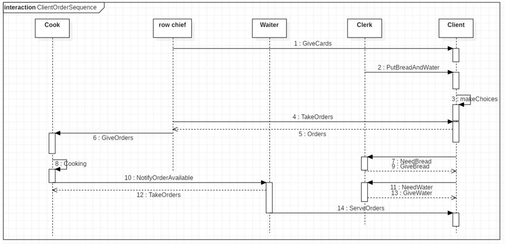
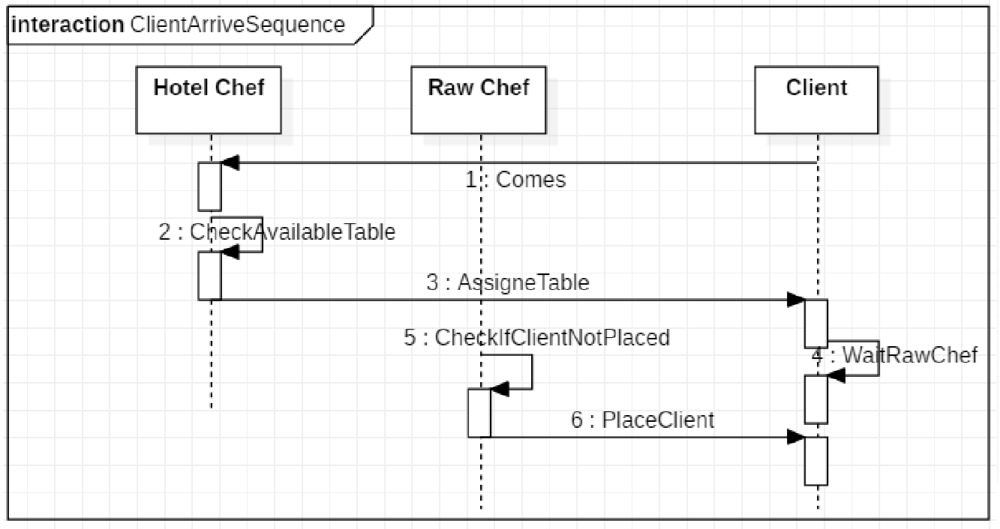
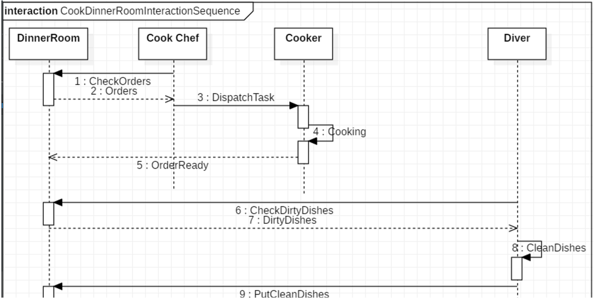
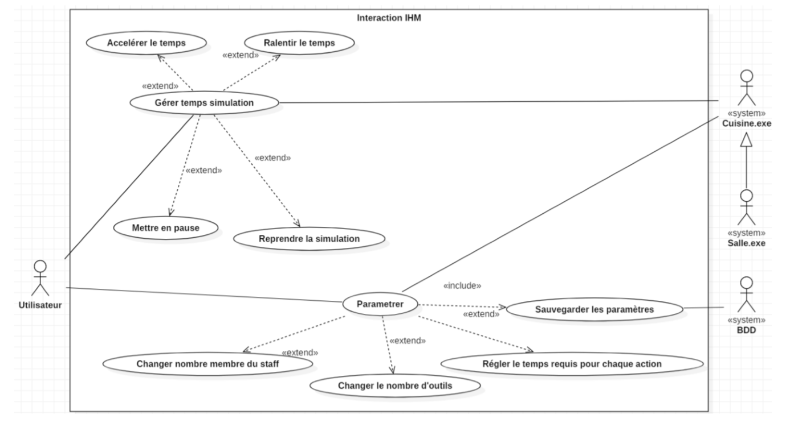
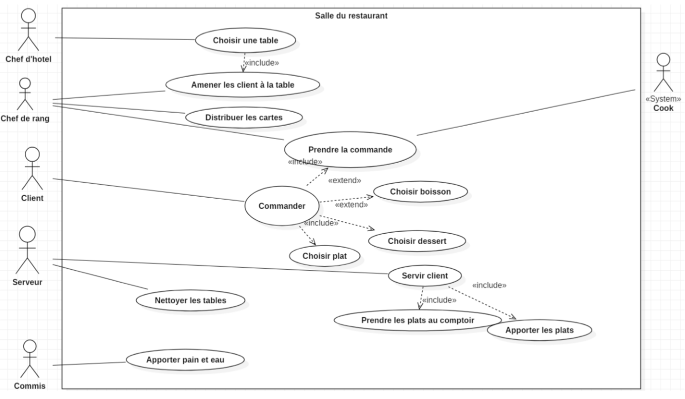

# Projet Marmiton

### Par Hugo RENARD, Mandel VAUBOURG, Baptiste FISCHINI, Alexandre SIXDENIERS

---

# Sommaire

* Presentation du projet
* Architecture 
* Design Pattern
* Connection à la BDD
* Spécifications
* Démonstration
* Conclusion

--- 
# Présentation du projet

---

# Architecture

+++

## Diagrammes de séquence

+++

+++

+++

## Diagrammes de uses cases

+++

+++

## Diagrammes de d'activité

+++ 

+++

---

# Design Pattern

## Injector Pattern

+++

## Singleton Pattern

+++

## Façade Pattern

+++

## Event Pattern

+++

## Commande Pattern

+++

## Bridge Pattern

---

# Connection à la BDD

---

# Spécifications

## IPC

+++

## Pool de threads

---

# Démonstration

---

# Conclusion