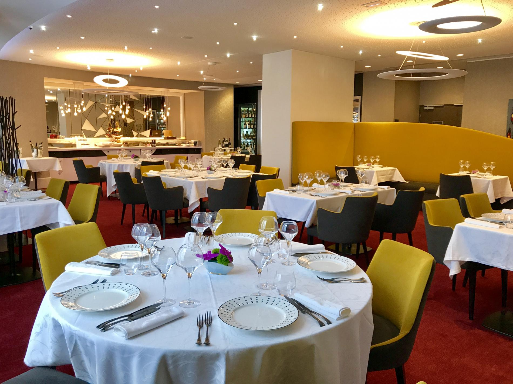

# Projet Marmiton

### Par Hugo RENARD, Mandel VAUBOURG, Baptiste FISCHINI, Alexandre SIXDENIERS

---

# Sommaire

* Presentation du projet
* Architecture 
* Design Pattern
* Connection à la BDD
* Spécifications
* Démonstration
* Conclusion

--- 
# Présentation du projet

---
#Architecture

+++
## Diagrammes de séquence

+++
## Diagrammes de uses cases

---
#Design Pattern

## Injector Pattern

+++
## Singleton Pattern

+++
## Façade Pattern

+++
## Event Pattern

+++
## Commande Pattern

+++
## Bridge Pattern

---
# Connection à la BDD

---
# Spécifications

## IPC

+++
## Pool de threads

---
# Démonstration

---
# Conclusion