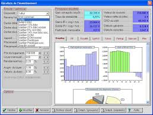

# Projet .NET
# Projet Marmiton

### Par Hugo RENARD, Mandel VAUBOURG, Baptiste FISCHINI, Alexandre SIXDENIERS

---
# Sommaire

..* Présenation du projet
..* Architecture 
..* Design Pattern
..* Connection à la BDD
..* Spécifications
..* Démonstration
..* Conclusion

--- 
# Présentation du projet

---
#Architecture

+++
## Diagrammes de séquence

+++
## Diagrammes de uses cases

---
#Design Pattern

## Injector Pattern

+++
## Singleton Pattern

+++
## Façade Pattern

+++
## Event Pattern

+++
## Commande Pattern

+++
## Bridge Pattern

---
# Connection à la BDD

---
# Spécifications

## IPC

+++
## Pool de threads

---
# Démonstration

---
# COnclusion