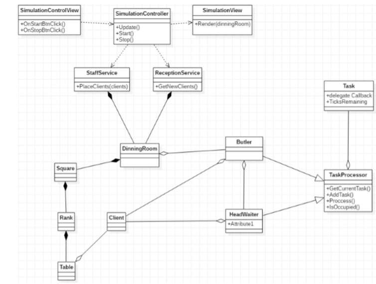
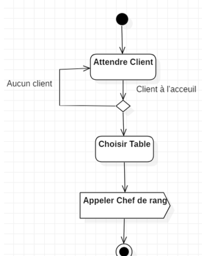
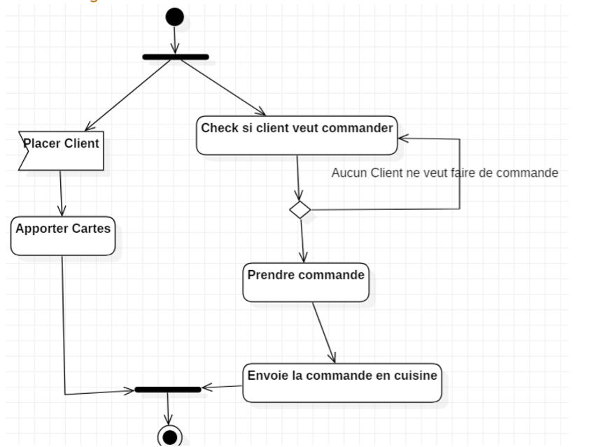
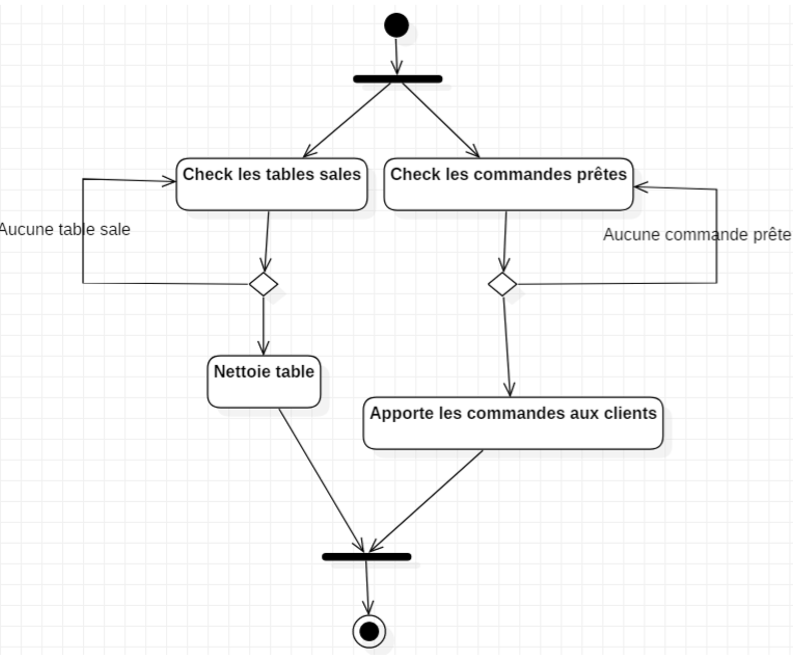
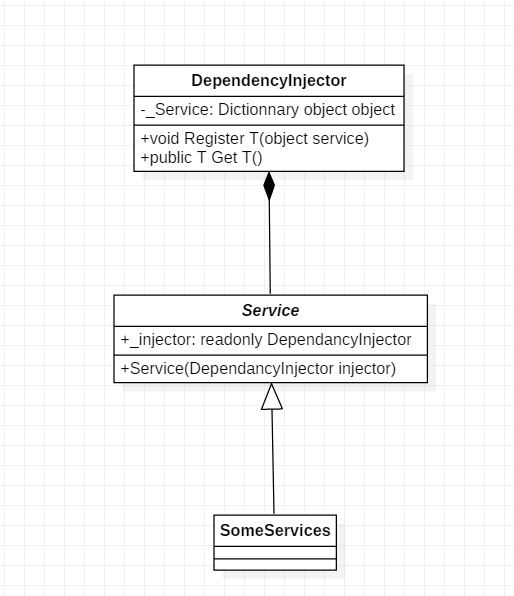
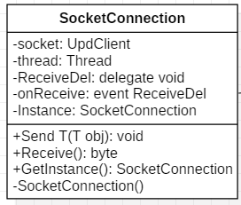
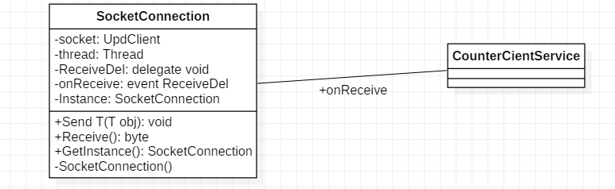
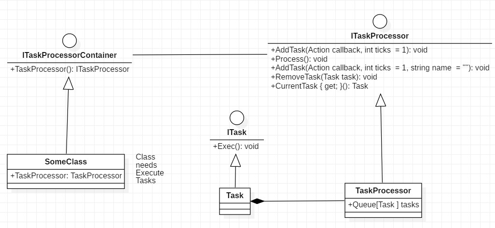
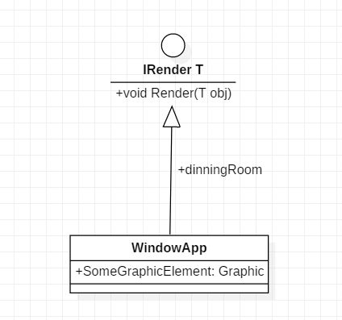
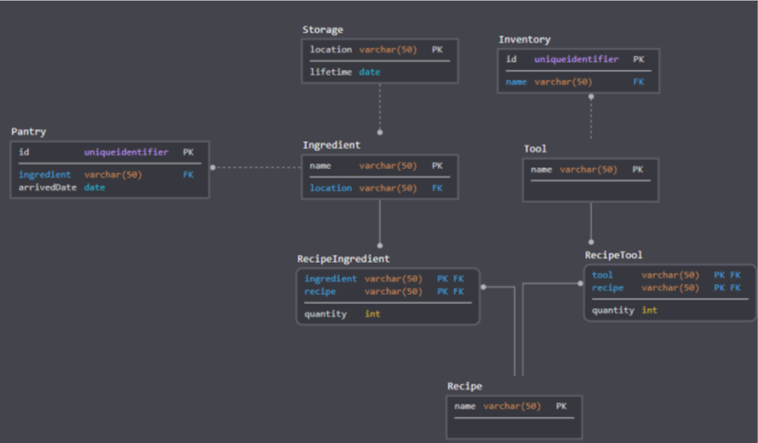

# Projet Marmiton

### Par Hugo RENARD, Mandel VAUBOURG, Baptiste FISCHINI, Alexandre SIXDENIERS

---

# Sommaire

- Presentation du projet
- Architecture
- Design Pattern
- Connection à la BDD
- Spécifications
- Démonstration
- Conclusion

---

# Présentation du projet

---

# Architecture

+++

## Diagrammes de séquence

+++

+++

+++

## Diagrammes de uses cases

+++

+++

## Diagrammes de d'activité

+++

+++

---

# Design Pattern

## Injector Pattern

+++

## Singleton Pattern

+++

## Event Pattern

+++

## Commande Pattern

+++

## Bridge Pattern

---

# Connection à la BDD

---

# Démonstration

---

# Conclusion
